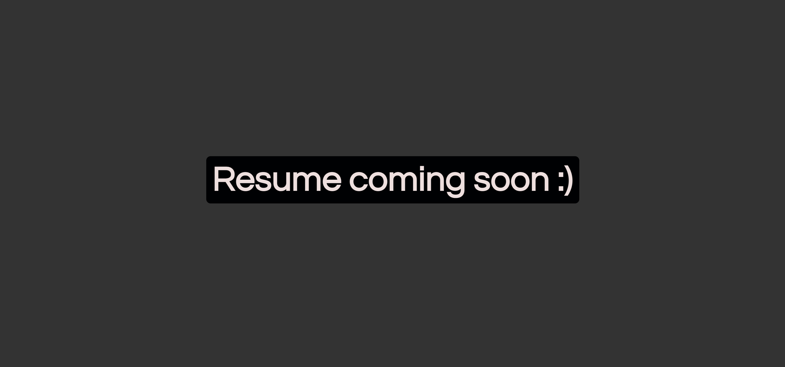

# Portfolio Page

## Description

This project is my portfolio page, created using a combination of HTML and CSS (to see it, click here: https://cedekpoole.github.io/portfolio-page/). Semantic HTML has been employed throughout and the CSS file is lined with comments to help other developers know what each selector is for. Flex Box and CSS Grid have been used in conjunction for this project as means to build a more responsive webpage. Both layout systems also allow developers to better organise their elements on a page. 

In addition to this, I have created a fixed header that permanently sticks to the top of the screen. Within this header, there are navigation links that take you to the different sections of my site. There are three main parts of the landing page: an 'About Me', 'Work' and a 'Contact Me' section. There is also a 'Resume' section that takes you to a separate HTML file (which is in progress). Within 'Work', all my completed projects are displayed. 

I have applied the 'mobile first' approach to responsive design for this project (to read more on this topic, see here: https://www.freecodecamp.org/news/taking-the-right-approach-to-responsive-web-design/). Put briefly, I began by first writing my CSS from the viewport of a mobile phone, then I implemented media queries to style elements for larger screen sizes. 

## Table of Contents 

- [Installation](#installation)
- [Usage](#usage)
- [Roadmap](#roadmap)
- [Credits](#credits)
- [License](#license)

## Installation

N/A 

## Usage

If you go to the landing page of my portfolio (link is in the desciption above), you can view all the content that I have currently made. Hover over the links in the header and click on one to see more information on that particular topic. The 'Resume' section - once clicked - will open up a new tab where you are directed to a page which currenly looks like this:

As you can see, the 'Resume' section is still in progress. Within 'Work', each clickable area opens the prescribed project in a new tab. You might also notice that these anchor elements increase slightly in size and the level of opacity changes when said elements are hovered over. A hover effect has also been placed on the icons within the footer element. 

To check the responsivenes of the site, inspect the page with Chrome Dev Tools (Option + Command + J on MacOS, Shift + Control + J on Windows/Linux). Once done so, you can toggle the device toolbar by pressing Command + Shift + M on MacOS, or Control + Shift + M on Windows/Linux. This will allow you to open up Device Mode, where you will be able to approximate how the page will look and feel from different viewport sizes. Change the width of the page from large to small in order to see how the elements respond. 

## Roadmap

This repo will be added to as my skills progress. The final aim for my portfolio page is to display a number of fully functioning projects - in addition to completing the Resume tab - while also being visually appealing. Any suggestions on how to improve the look and functionality of the page are welcome :). 

## Credits 

N/A

## License

Please refer to the LICENSE in the repo. 